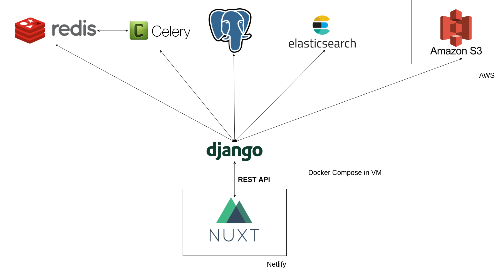

# Yet Another Free (OSS) Instagram-clone

**Status: Not in development at the moment**

Inspired by [Realword project from Thinkster](https://github.com/gothinkster/realworld), this project is aimed at the same goal:

> While most "todo" demos provide an excellent cursory glance at a framework's capabilities, they typically don't convey the knowledge & perspective required to actually build real applications with it.

**YAFIG** is aimed to build a production-ready **Instagram-clone** with minimal functionalities. This project will only implement the following features:

- Register & User login
- User can follow or block other users
- Upload, edit and delete a post
- Comment & like posts
- Search the posts

The backend of this project will be implemented in two approaches: microservice & monolithic architecture in Jamstack style.

## Table of Contents

- [But why](#But-why)
- [Detailed Specs](#Detailed-specs)
- [Implementation](#Implementation)
- [Who made this](#Who-made-this)

## But why

This project is an initiative for me to learn *in public* by building a real project from scratch. I am pretty sure I have a lot of things to learn along this journey. This is my greenfield to test new technologies that interest me.

Some parts of this system are not implemented consistently. For example, you will see one module is implemented in MVC architecture and another in Clean architecture. This is intentional because I wanted to learn different approaches to do the same thing. Speed is not my priority in this project. It may takes time for me to understand many of the framework/technology in detail, so I don't mind taking a longer time to understand them in detail.

## Detailed Specs

### Entities

### Resources

These resources design is influenced by [Microsoft API Design guidance](https://docs.microsoft.com/en-us/azure/architecture/best-practices/api-design)

#### User Resource

| Resource | POST | GET | PUT | DELETE |
|----------|------|-----|-----|--------|
| /users | | Authenticate user based on Header Authorization supplied | | |
| /users/register | Create a new user. This will send an welcome email to the new user. | | | |
| /users/login | Login the user and return a JWT token | | | |
| /users/{username} | | Get user details | Update user | Delete user |
| /users/{username}/posts/ | | Get user's posts | | |
| /users/follow/{username} | | Creates a new record in `relationship` table and update `follow_count` of that user | | |
| /users/block/{username} | | Creates a new record in `relationship` table and remove blocked user posts from timeline table | | |

- `/users` is mainly for the frontend website to authorize the current user context
- Follow and block operations will generate a materialized views in the database in the database to save the compute power during query. It will be executed in a single database transaction.

#### Post Resource

The operations exposed via HTTP REST are:

| Resource | POST | GET | PUT | DELETE |
|----------|------|-----|-----|--------|
| /posts/  | Upload a new post | Get user's posts | |
| /posts/timeline/   | | Get user's timeline | |
| /posts/{id}/ | | Get post | Update post | Delete post |
| /posts/user/{user_id}/ | | Get posts by user | | |
  
- After posting a new picture, it will generate a thumbnail and index the new post in Elasticsearch
- Deleting a post will delete the post's comment

#### Comment Sub-resource

The HTTP REST operations are:

| Resource | POST | GET | PUT | DELETE |
|----------|------|-----|-----|--------|
| /posts/{post_id}/comments/ | Create a new comment | Get post's comments | | |
| /posts/{post_id}/comments/{comment_id}/ | | Get a comment | Edit post comment | Delete comment

#### Search Resource

Search will be based on:

- tags
- description
- user

Search service is exposed via HTTP REST. The HTTP REST operation is:

- **GET** `/search/query?query={query}&limit={limit}&offset={offset}`

  Search for posts with `limit` and `offset` parameters are for the search result pagination.

- **GET** `/search/autocomplete?query={query}`

  This is for the search form to display autocomplete suggestions in the frontend

### Frontend

The page will have the following paths:

1. Main page at `/` path
2. Login page at `/login` path
3. Register page at `/register` path
4. Feed page at `/feed` path
5. Post CRUD pages at `/p/{id}` path
6. User CRUD pages at `/u/{id}` path
7. Profile page at `/u/{own id}` path
8. Search page at `/search` path
8. Upload page at `/upload` path

Frontend specs:

- **Jamstack** approach where each operation on the site will perform API requests to the API endpoints
- The frontend must be able to be served from CDN and/or Object Storage.

## Implementations

### Frontend

The frontend is implemented in:

- **[VueJS + NuxtJS](https://github.com/yafig/frontend)**.

Other frameworks that I might be interested to explore next would be **Svelte** and **NextJS**.

### Backend Service

The API Servers will be implemented in two approaches: Monolithic and Microservice. Both of them are doing essentially the same thing, but in a different manner.

- **[Python](https://github.com/yafig/api-server-monolith/tree/master/python-django-rest)** using **Django REST Framework** (DRF).

Development approaches for each resource:

| Django App | Details |
|------------|---------|
| API Doc    | Uses [DRF YASG](https://drf-yasg.readthedocs.io/en/stable/) to generate API Doc |
| User       | Written in DRF function-based views & SimpleJWT library for authentication. |
| Post       | Written in [Generic Views](https://www.django-rest-framework.org/api-guide/generic-views/) |
| Search     | Written in class-based views |

External services used:

- PostgreSQL
- Celery
- Redis
- Elasticsearch

### DevOps

- Use CircleCI for CI/CD automation
- Docker for containerization

### Infrastructure

- Setup minimal S3 permission with [this policy permission](https://django-storages.readthedocs.io/en/latest/backends/amazon-S3.html#iam-policy).
- VM is hosted in Hetzner Germany region

### Wishlist

- Celery & Celery Beatx
- Reliability: [on_commit()](https://docs.djangoproject.com/en/3.0/topics/db/transactions/) message dispatching, atomic transaction
- Performance optimizations: Select_Related, Prefetch_related, defer & only query, query annotation, Func
- Queryset Q & F
- FilterSet
- Django-cacheops
- Django social login
- Django Channel & [Shared WebWorker](https://noti.st/aaronbassett/xzOUkb)
- django-debug-toolbar & django-silk
- uptime monitoring
- [APM](https://www.youtube.com/watch?v=optor4DsgvY)
- django-url-filter
- Varnish caching (serving static cache even the API is breaking)
- Rate limiting
- Load testing with Locust
- django-memoize
- ORM: unique_together, indexes & partial/conditional index, Lag, Window, raw SQL, select extra, custom queryset and custom manager, inspect query (`str(order.query`)

## References

- [Build user registration & authorization using SimpleJWT](https://hackernoon.com/110percent-complete-jwt-authentication-with-django-and-react-2020-iejq34ta), [Github repo](https://github.com/Toruitas/Complete-JWT-Authentication/?ref=hackernoon.com)
- [JWT Auth with DjangoREST API
](https://medium.com/swlh/jwt-auth-with-djangorest-api-9fb32b99b33c)
- [Django REST OpenAPI 3 Support](https://djangoadventures.com/django-rest-framework-openapi-3-support/)
- [Build File/Image upload in DRF](https://www.techiediaries.com/django-rest-image-file-upload-tutorial/)
- [Upload files to S3 using DRF](https://stackoverflow.com/questions/46195181/upload-file-to-s3-using-drf)
- [Soft Deletion in Django](https://adriennedomingus.com/blog/soft-deletion-in-django)
- [Building a Full-Text Search App Using Django, Docker and Elasticsearch](https://dev.to/aymanemx/building-a-full-text-search-app-using-django-docker-and-elasticsearch-3bai)
- [Build Elasticsearch autocomplete feature for Django app](https://itnext.io/elasticsearch-autocomplete-for-django-9dffef1d3afb)
- [Build Elasticsearch with Django](https://medium.com/@s.lyapustin/django-polls-app-with-elasticsearch-ffc02b9e79d9)

NuxtJS / Vuejs

- [How to build image upload & preview in VueJS](https://stackoverflow.com/questions/49106045/preview-an-image-before-it-is-uploaded-vuejs)

## Conferences

- [DjangoCon US 2016 - High-Availability Django by Frankie Dintino](https://www.youtube.com/watch?v=lAMlZviIPw4&list=PLE7tQUdRKcyZNknh0wA44b5IEIxQ37vL7&index=10)
- [DjangoCon 2014- High-Performance Django: From Runserver to Reddit Hugs](https://www.youtube.com/watch?v=Toa9lW8UMOA)
- [DjangoCon 2019 - Prepping Your Project for Production by Peter Baumgartner](https://www.youtube.com/watch?v=tssYpA6WiQM)
- [DjangoCon 2019 - Pushing the ORM to its limits](https://www.youtube.com/watch?v=MPpPu6c8wsM)
